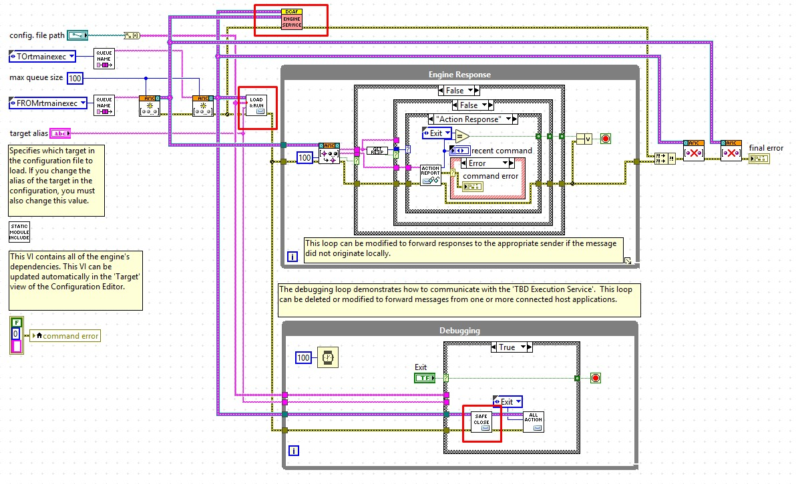

# Overview
This module is intended to communicate latest value tags between the DCAF Engine and an FPGA VI.

# Description
The underlying method of communication used by this module is [FPGA Read/Write Controls](http://zone.ni.com/reference/en-XX/help/371599P-01/lvfpgahost/readwrite_control/). 
Considering this, you will only be able to access elements in the front panel of your FPGA VI . Use this module only to exchange latest value tags between DCAF and the FPGA. To stream data at high rates, use a different approach based on DMA FIFOs. 

# Steps to use this module

## Configuration of the FPGA Module

1. Create, compile and verify your FPGA VI. Keep in the front panel of this VI the controls and indicators you would like to access from DCAF.
2. Load the FPGA Module in your DCAF configuration. There are two different approaches to configure the channels in the module. The first one, you can manually add the controls and indicators that will be used for communication as it is shown in the image below.

**Channel Name:** The name of Control/Indicator in the front panel of the FPGA VI.

**Access Type:** Whether the data will be coming into the DCAF module from the FPGA (Read from HW) or out to the FPGA from DCAF (Write to HW).

**Data Type:** The data type of the Control/Indicator.

**Tag:** The Tag you want to connect the channel to in the DCAF Engine.

3. A second and simpler approach is based on loading the channels to communicate from the FPGA VI itself. Press the *Load Channels from VI* button, navigate and select your FPGA VI. When prompted, press *Yes* to automatically map the tags to channels.

4. Finally, configure the **RIO Device** with the name of the FPGA resource that will run your compiled bitfile. Your final configuration would look similar as the one shown in the image below.

## Modifying the Runtime Template to Load and Execute the FPGA Bitfile
For this module to work, the FPGA bitfile needs to be loaded and executed from your Host VI. The required steps to follow will depend on the template being used to launch your DCAF configuration. 

### Using the DCAF Basic Execution Template
1. Open the **Host Main.vi** from the template. You will modify the sections of code indicated in the image below.

2. Enable the section of code in the left by right clicking the *Diagram Disable Structure* and selecting *Enable This Subdiagram*. Configure the *Open FPGA VI Reference VI* to point to your FPGA VI, bitfile or build specification. 

3. Enable the section of code in the right by right clicking the *Diagram Disable Structure* and selecting *Enable This Subdiagram*. Your final VI could look similar as the one in the image below.

### Using the DCAF Execution Service
1. Open the **cRIO Main.vi** rom the template. You may need to modify the 3 subVIs highlighted in the image below.

2. Open the **DCAF Execution Service.vi**. Navigate to the *Load Bitfile* case in the internal *Case Structure*. Enable the section of code inside this case by right clicking the *Diagram Disable Structure* and selecting *Enable This Subdiagram*. Configure the *Open FPGA VI Reference VI* to point to your FPGA VI, bitfile or build specification. 

3. Navigate to the *Unload Bitfile* case in the internal *Case Structure*. Enable the section of code inside this case by right clicking the *Diagram Disable Structure* and selecting *Enable This Subdiagram*. 

4. Save and close the **DCAF Execution Service.vi**.

5. Open the **load from file and runn all.vi**. Make sure a *Load Bitfile* command is being queued as shown in the image below. If not, modify this VI to add this functionality and save it.

6. Open the **safe state stop and close.vi**. Make sure an *Unload Bitfile* command is being queued as shown in the image below. If not, modify this VI to add this functionality and save it.

# Software Requirements

+   LabVIEW 2015 or later
+   LabVIEW RT 2015 or later
+   LabVIEW FPGA 2015 or later
+   CompactRIO 15.0 or later
+   LabVIEW FPGA Advanced Session Resources for the corresponding LabVIEW version: https://forums.ni.com/t5/NI-Labs-Toolkits/LabVIEW-FPGA-Advanced-Session-Resources/ta-p/3500447

