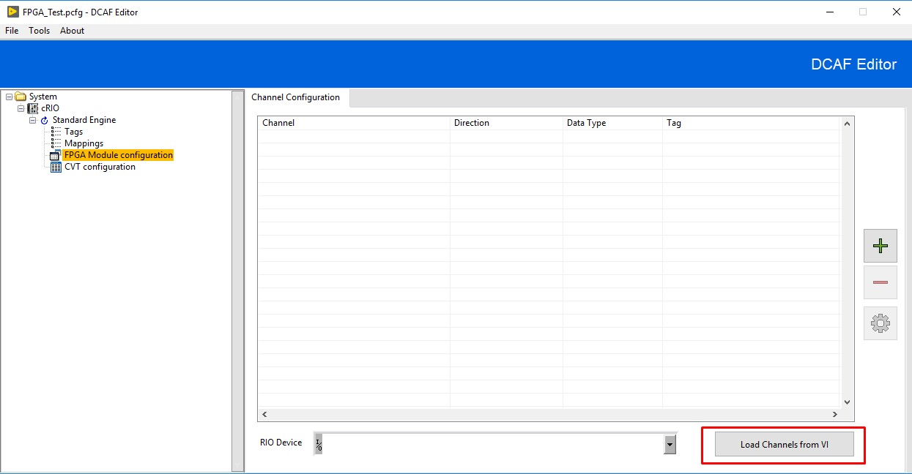

# Overview
This module is intended to communicate latest value tags between the DCAF Engine and an FPGA VI.

# Description
The underlying method of communication used by this module is [FPGA Read/Write Controls](http://zone.ni.com/reference/en-XX/help/371599P-01/lvfpgahost/readwrite_control/). 
Considering this, you will only be able to access elements in the front panel of your FPGA VI . Use this module only to exchange latest value tags between DCAF and the FPGA. To stream data at high rates, use a different approach based on DMA FIFOs. 

# Steps to use this module

## Configuration of the FPGA Module

1. Create, compile and verify your FPGA VI. Keep in the front panel of this VI the controls and indicators you would like to access from DCAF.
2. Load the FPGA Module in your DCAF configuration. There are two different approaches to configure the channels in the module. First, you can manually add the controls and indicators that will be used for communication as it is shown in the image below.

**Channel Name:** The name of Control/Indicator in the front panel of the FPGA VI.

**Access Type:** Whether the data will be coming into the DCAF module from the FPGA (Read from HW) or out to the FPGA from DCAF (Write to HW).

**Data Type:** The data type of the Control/Indicator.

**Tag:** The Tag you want to connect the channel to in the DCAF Engine.

3. A second and simpler approach is based on loading the channels to communicate from the FPGA VI itself. Press the *Load Channels from VI* button, navigate and select your FPGA VI. When prompted, press *Yes* to automatically map the tags to channels.

4. Finally, configure the RIO device with the name of the FPGA resource that will run your compiled bitfile. Your final configuration would look similar as the one shown in the image below.

# Software Requirements

+   LabVIEW 2015 or later
+   LabVIEW RT 2015 or later
+   LabVIEW FPGA 2015 or later
+   CompactRIO 15.0 or later
+   LabVIEW FPGA Advanced Session Resources for the corresponding LabVIEW version: https://forums.ni.com/t5/NI-Labs-Toolkits/LabVIEW-FPGA-Advanced-Session-Resources/ta-p/3500447

